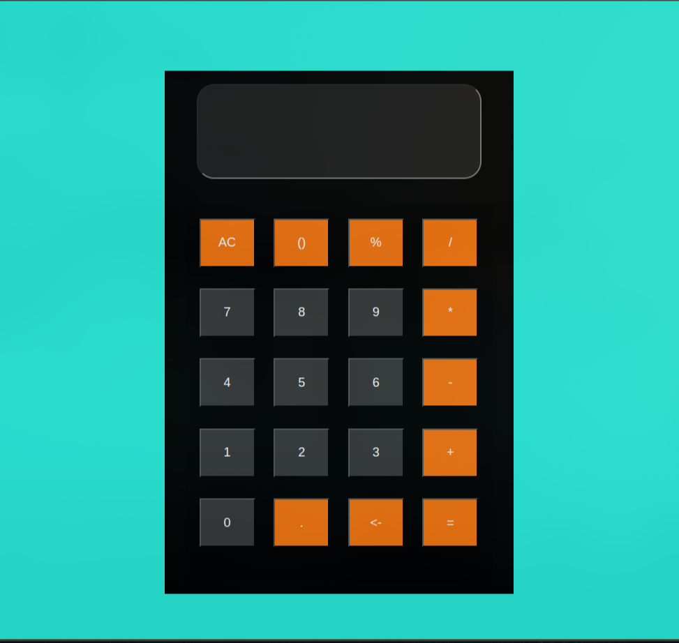

# 🔢 JavaScript Calculator

A simple and clean calculator built using **HTML**, **CSS**, and **JavaScript**.  
Supports basic arithmetic operations and keyboard-free interaction.

---

## ✨ Features

- 📱 Responsive layout
- 🧮 Basic operations: `+`, `-`, `*`, `/`, `%`
- 🧠 Handles brackets `(` and `)`
- ❌ Clear all with `AC` button
- ⌫ Backspace support
- ✅ Error handling with auto-reset after 2 seconds

---

## 📸 Screenshot



---

## 🛠️ Technologies Used

- HTML5
- CSS3
- Vanilla JavaScript (no libraries)

---

## 🚀 How to Use

1. Clone the repo or download the files:
   ```bash
   git clone https://github.com/your-username/js-calculator.git
2. Open index.html in your browser.
3. Click the calculator buttons to perform calculations — no keyboard 
   needed!